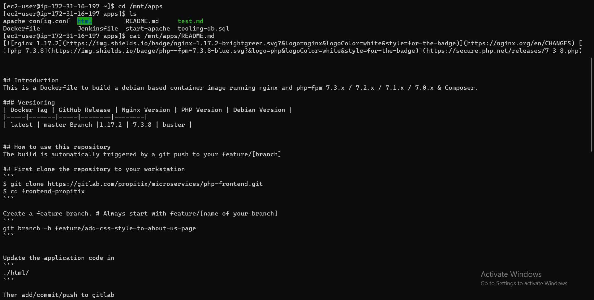

# CREATING TOOLING WEBSITE DEPLOYMENT AUTOMATION WITH CONTINUOUS INTEGRATION

### Creating an AWS EC2 server based on Ubuntu Server 20.04 LTS and name it “Jenkins”

### Install JDK (because Jenkins is a Java-based application)

`sudo apt update`

`sudo apt install default-jdk-headless`

## Install Jenkins

`curl -fsSL https://pkg.jenkins.io/debian-stable/jenkins.io-2023.key | sudo tee \
  /usr/share/keyrings/jenkins-keyring.asc > /dev/null`

`echo deb [signed-by=/usr/share/keyrings/jenkins-keyring.asc] \
  https://pkg.jenkins.io/debian-stable binary/ | sudo tee \
  /etc/apt/sources.list.d/jenkins.list > /dev/null`

`sudo apt-get update`

`sudo apt-get install jenkins`

### confirming if Jenkins is up and running

`sudo systemctl status jenkins`

### opening port 8080 for Jenkins

[accessing Jenkins through browser](http://<Jenkins-Server-Public-IP-Address-or-Public-DNS-Name>:8080)

### Retrieving password to unlock Jenkins in browser using the code below in the Jenkins server

`sudo cat /var/lib/jenkins/secrets/initialAdminPassword`

### Creating first user on Jenkins

## Configuring Jenkins to retrieve source codes from GitHub using Webhooks

### Enabling webhooks in your GitHub my settings

### create a new repository in my account (destination), then import repository using https copied from source github account

### Go to settings in tooling repository in destination github account, enter the Jenkins server public ip address as shown in image then add webhook

### webook addition confirmation page

###  Go to Jenkins web console, click “New Item” enter an item name and create a “Freestyle project”

### To connect your GitHub repository from Jenkins, you will need to provide its URL, you can copy from the repository itself

### In the general page check git in the source code management pane and paste code in repository url and add credentials (by entering my git username and password in the fields) then click on jenkins  if you get an http 403 no valid crumb simply go to settings >configure global security > CSRF Protection > check or mark Enable proxy compatibility

### go to Build now, then find Build history down then click on the option 

### click on console output in the left pane to check if it was a success

## Step 3

from dashboard click on the item (project9) > configure > build triggers > check or mark GitHub hook trigger for GITScm polling

buid environment > add post build action > archive the artifacts > type ** in the files to archive field > save

### Go to github > tooling repository > click on the readme file to edit the file > click edit > scroll down to the last part enter "Checking Jenkins" > commit changes

### Go to status on Jenkins and confirm settings

`sudo systemctl restart jenkins`

`cd /var/lib/jenkins/`

`ls`

`cd jobs`

`cd project9`

`cd builds`

`cd 2`

`cd archive`

## Step 4 – Configure Jenkins to copy files to NFS server via SSH

### first we have to in stall plugins in Jenkins... go to Dashboard > manage Jenkins > plugins > available plugins > search "Publish Over SSH" > click on install without restart button

### Configure the job/project to copy artifacts over to NFS server

### Dashboard > manage jenkins > configure system > look for the "Publish Over SSH" we just downloaded configure it as shown in image below > test configuration > save
note .pem key was copied to the key field and also the NFS private ip address was copied to the host name

### go to project > configure > build triggers > add post build actions > send build artifacts over SSH > set "source files" to ** > save

### go to > github tooling readme file > edit it by deleting "Checking Jenkins" commit changes  

`sudo chown -R nobody:nobody /mnt` in the nfs server

`sudo chmod -R 777 /mnt` in the nfs server

### go to dashboard in jenkins > project9 > build now > click on the latest build #5 (in my case) > console output

`cd`     in the nfs server

`cd /mnt/apps`      in the nfs server

`cat /mnt/apps/README.md`      in the nfs server

